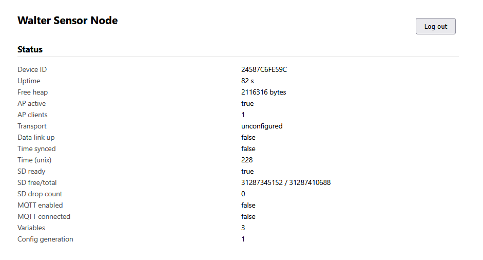
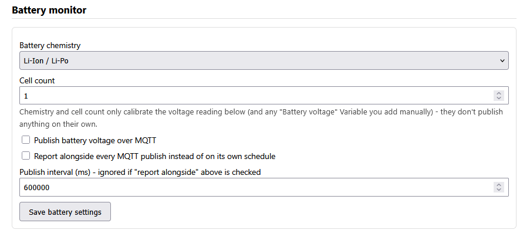
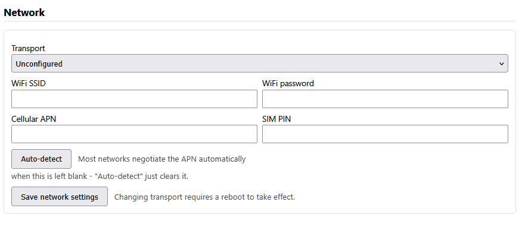
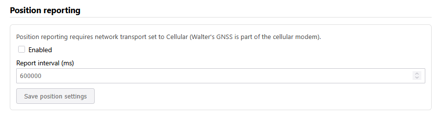
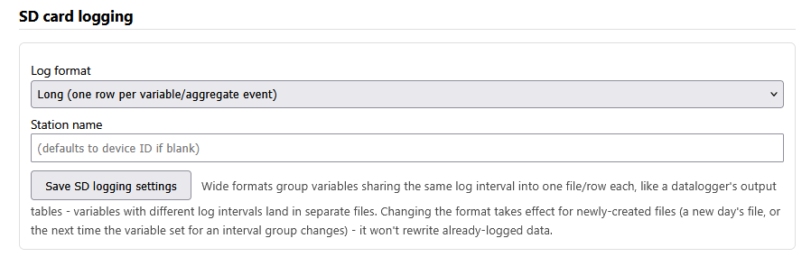
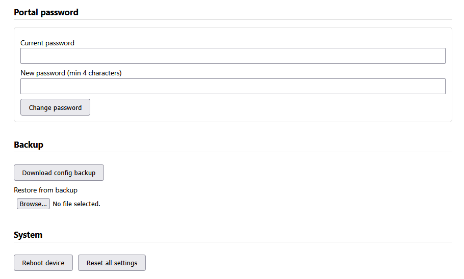

# Walter Sensor Node — User Manual

This manual is for anyone setting up or operating a Walter Sensor Node —
no programming or firmware knowledge required. Everything described here is
done through your phone or laptop's web browser, via the device's built-in
setup portal.

If you're looking for how the firmware itself is built (to modify the code,
add a new sensor driver, etc.), see [DEVELOPER_GUIDE.md](DEVELOPER_GUIDE.md)
instead.

---

## Table of contents

1. [What is this?](#1-what-is-this)
2. [What you'll need](#2-what-youll-need)
3. [Quick start](#3-quick-start)
4. [Connecting to the portal](#4-connecting-to-the-portal)
5. [The Status panel](#5-the-status-panel)
6. [Adding sensors (Variables)](#6-adding-sensors-variables)
7. [Setting up MQTT](#7-setting-up-mqtt)
8. [Choosing your network](#8-choosing-your-network)
9. [Position reporting](#9-position-reporting)
10. [Where your data goes](#10-where-your-data-goes)
11. [Account and security](#11-account-and-security)
12. [Backup and restore](#12-backup-and-restore)
13. [Rebooting](#13-rebooting)
14. [How the setup hotspot behaves](#14-how-the-setup-hotspot-behaves)
15. [Troubleshooting](#15-troubleshooting)
16. [Glossary](#16-glossary)
17. [Quick reference](#17-quick-reference)

---

## 1. What is this?

The Walter Sensor Node is a small, self-contained environmental data logger
built around the Walter ESP32-S3 module and the Walter Feels carrier board.
It can:

- Read **SDI-12** sensors (soil moisture, weather stations, water level
  probes, etc. — anything speaking the SDI-12 protocol).
- Read **I2C** sensors (e.g. analog-to-digital converter boards for sensors
  that output a voltage).
- Log everything to a **microSD card** as CSV files you can open in Excel,
  Google Sheets, or pandas.
- Publish data to an **MQTT broker** over WiFi or a cellular (4G/LTE-M/NB-IoT)
  connection, so you can watch it live on a dashboard.
- Report its **GPS position** (cellular only), useful for mobile or
  multi-site deployments.
- Be fully configured **without writing any code** — every sensor, every
  timing setting, and every network/MQTT credential is set through a web
  page served by the device itself.

You never need to reflash the firmware to deploy a new sensor node or change
what it measures — you only reflash once, when the firmware itself changes.

---

## 2. What you'll need

- The Walter Sensor Node hardware, powered on (USB or the board's power
  input).
- A phone, tablet, or laptop with WiFi.
- Your sensors physically connected to the SDI-12 and/or I2C connectors
  on the carrier board (see your board's documentation for exact wiring —
  this manual covers the *software* side only).
- If you'll use MQTT: the address of an MQTT broker (ask your instructor or
  IT contact if you don't have one — a broker is free/easy to run for a lab
  setting, e.g. Mosquitto).
- If you'll use cellular data: a SIM card with a data plan, and its APN
  (Access Point Name — ask your carrier).
- A microSD card, formatted FAT32, inserted in the board, if you want local
  logging (recommended even if you're also using MQTT — it's your durable
  backup).

---

## 3. Quick start

For the impatient — the short version, expanded on in the sections below:

1. Power on the device.
2. On your phone/laptop, connect to the WiFi network named
   **`WalterSensor-XXXX`** (an open network, no WiFi password).
3. A login page should pop up automatically. If not, open a browser and go
   to `http://192.168.4.1/`.
4. Log in with the default password **`walter1234`**.
5. **Immediately change the password** (Portal password section).
6. Add your sensors under **Variables**.
7. Configure **MQTT** and/or **Network** if you want data sent off-device.
8. Done. The device starts sampling immediately; no reboot needed unless you
   changed the network transport.

---

## 4. Connecting to the portal

When the device boots, it starts a WiFi hotspot (access point) named
**`WalterSensor-XXXX`**, where `XXXX` is four characters unique to your
specific device (derived from its hardware address, so two devices never
clash). This hotspot is **open** — no WiFi password is needed to join it.

- The hotspot is active for the first **5 minutes** after every boot,
  whether or not anyone connects.
- After that, it stays on for as long as **at least one device is
  connected** to it, and switches off once the last device disconnects.
  See [section 14](#14-how-the-setup-hotspot-behaves) for the full
  explanation.

Once connected to the hotspot, most phones and laptops will automatically
pop up a "sign in to network" browser window (this is the same mechanism
used by hotel/airport WiFi). If it doesn't appear, open any browser and go
to:

```
http://192.168.4.1/
```

You'll see a login page asking for the **portal password**. The factory
default is:

```
walter1234
```

**Change this immediately** after your first login — see
[section 11](#11-account-and-security).

Once logged in, you stay logged in (via a browser cookie) for 30 minutes of
inactivity, after which you'll need to log in again. Up to 4 people can be
logged in to the same device at once (e.g. a few teammates on different
laptops).

---

## 5. The Status panel

The first thing you see after logging in is the **Status** panel, which
refreshes automatically every 5 seconds. Here's what each field means:

<figure markdown>

<figcaption>The Status panel, right after login.</figcaption>
</figure>

| Field | Meaning |
|---|---|
| Device ID | A unique, permanent 12-character ID for this specific device (derived from its hardware address). Used to tell devices apart in shared MQTT topics and to identify CSV files. |
| Uptime | How long since the device last booted. |
| Free heap | Available RAM, in bytes — mostly useful for diagnosing problems, not something you need to manage. |
| AP active | Whether the setup hotspot is currently on. |
| AP clients | How many devices are currently connected to the hotspot. |
| Transport | Which network transport is configured: `unconfigured`, `wifi`, or `cellular`. |
| Data link up | Whether the chosen transport (WiFi station / cellular) is actually connected right now. |
| Time synced | Whether the device has obtained the correct current time (via internet time sync, or cellular network time). Until this is true, logged timestamps aren't reliable — see [Troubleshooting](#15-troubleshooting). |
| SD ready | Whether the microSD card is mounted and working. |
| SD free/total | Free / total space on the SD card, in bytes. |
| SD drop count | Number of log entries that failed to write (card removed, full, etc). Should stay at 0 in normal operation. |
| MQTT enabled | Whether you've turned MQTT on in settings. |
| MQTT connected | Whether the device currently has an active MQTT connection. If batch transmission is on, this is only briefly `true` during each transmit window — see [section 7.4](#74-batch-transmission-saving-power). |
| Position enabled / Last fix | Only shown when transport is Cellular — whether position reporting is on, and the most recent GPS fix obtained. |
| Variables | How many sensors/variables you've configured. |
| Config generation | An internal counter that increases every time you change a setting — not something you need to act on. |

---

## 6. Adding sensors (Variables)

In this firmware, each individual measurement you want to record and report
is called a **variable** — e.g. "Soil Moisture 10cm" or "Battery Voltage."
A single physical sensor can produce more than one variable (e.g. a weather
station reporting both temperature and humidity would be two variables).

You can configure up to **32 variables** on one device.

### 6.1 Adding a variable

Click **+ Add variable** under the Variables section. You'll be asked for:

| Field | What to enter |
|---|---|
| Name | A short, unique label (e.g. `soil_temp_10cm`). This becomes the CSV column context and the MQTT topic segment for this variable, so keep it simple — letters, numbers, underscores. |
| Unit | Free text, e.g. `degC`, `%RH`, `V`. This is just a label shown in the portal and not interpreted by the firmware — use whatever makes sense to you. |
| Bus type | `SDI-12` or `I2C` — which physical bus the sensor is wired to. |
| *(SDI-12 sensors)* Address | The sensor's SDI-12 address: a single character `0`-`9`, `A`-`Z`, or `a`-`z`. Most sensors ship set to `0`; see [6.2](#62-finding-your-sensors-address) to find out what's actually on your bus. |
| *(SDI-12 sensors)* Parameter index | SDI-12 sensors often return several values in one reading (e.g. a soil probe might return moisture, temperature, and conductivity together). This is a zero-based index into that list: `0` for the first value, `1` for the second, etc. |
| *(I2C sensors)* I2C address | The sensor's 7-bit I2C address, in decimal (e.g. `72` for the common `0x48`). For the onboard sensor device types below, this defaults to that chip's fixed/typical address — see [6.5](#65-onboard-walter-feels-sensors-battery-temperature-humidity-pressure). |
| *(I2C sensors)* Device type | Which built-in driver to use to talk to this chip: `ADS111x` (external ADC, returns a voltage), `Generic` (a fallback that just reads a raw 16-bit register with no interpretation), or one of the **onboard Walter Feels sensors** (battery monitor, temperature, humidity, pressure — see [6.5](#65-onboard-walter-feels-sensors-battery-temperature-humidity-pressure)). |
| *(I2C sensors)* ADS111x input / Register address | For the ADC driver, a dropdown lets you pick which input to read: single-ended `AIN0`-`AIN3` (each measured against ground), or one of four **differential** pairs (`AIN0-AIN1`, `AIN0-AIN3`, `AIN1-AIN3`, `AIN2-AIN3` — the difference between the two inputs, useful for sensors like load cells/bridges/differential pressure that output a small voltage difference rather than a single-ended signal). For the generic driver, this field is instead a plain register address to read. |
| *(I2C sensors)* ADS111x gain / full-scale range | Only for the ADC driver: the input range the reading is scaled against, from `+/-6.144V` down to `+/-0.256V`. Pick the smallest range that still comfortably covers your signal's expected peak, for the best resolution — e.g. `+/-2.048V` for a 0–1.5V signal, `+/-6.144V` for a 0–5V signal. This does **not** change the chip's absolute maximum input voltage, which is always its own supply voltage + 0.3V regardless of gain — a 0–5V signal needs the ADS1115 itself powered from 5V, not 3.3V. Every ADS111x reading is actually an average of several conversions taken over 100ms, which rejects both 50Hz and 60Hz mains hum (see `ads111x.c`) — fine for slowly-varying signals like panel voltage or a pyranometer, but not intended for capturing fast transients. |
| Sample interval (ms) | How often the sensor is physically read, in milliseconds. Default: 60000 (once a minute). |
| Log/aggregate interval (ms) | How often a summary of the recent samples is written to SD/MQTT, in milliseconds. Must be **greater than or equal to** the sample interval. Default: 300000 (every 5 minutes). |
| Aggregates | Which statistics to compute and report over each log interval — see [6.3](#63-understanding-sampling-vs-logging-vs-aggregation). |
| Calibration multiplier (a) / offset (b) | Applied to every raw reading before logging/aggregation: `calibrated = a × raw + b`. Defaults (`a=1`, `b=0`) leave readings unchanged — see [6.6](#66-calibrating-a-variable-ax-b). |
| Enabled | Untick to keep the configuration saved but pause this variable without deleting it. |

### 6.2 Finding your sensor's address

If you don't know your SDI-12 sensor's address, or your I2C sensor's
address, use the **Scan SDI-12 bus** / **Scan I2C bus** buttons above the
variable list. This probes every possible address on the bus and reports
which ones respond. An SDI-12 scan can take a few seconds since it tries up
to 62 possible addresses. I2C results are shown as a decimal number with
the hex equivalent alongside (e.g. `72 (0x48)`) — enter the **decimal**
number into the "I2C address" field, since that field only accepts plain
decimal.

### 6.3 Understanding sampling vs. logging vs. aggregation

This is the most important concept to understand for meaningful data:

- **Sample interval**: how often the device actually takes a raw reading
  from the sensor. Think of this as your measurement resolution.
- **Log interval**: how often those raw samples get *summarized* into one
  row written to the SD card and/or sent over MQTT.
- **Aggregates**: which summary statistics are computed from all the raw
  samples collected during one log interval:
  - **raw** — just the single most recent sample (no averaging).
  - **mean** — the average of all samples in the interval.
  - **min** / **max** — the smallest/largest sample seen in the interval.
  - **stddev** — standard deviation, a measure of how much the readings
    varied during the interval (useful for spotting noisy sensors or
    unstable conditions).

**Example**: a soil moisture sensor with a sample interval of 10,000 ms
(every 10 seconds) and a log interval of 600,000 ms (every 10 minutes), with
"mean" and "stddev" checked, will take 60 raw readings every 10 minutes and
write one row containing their average and standard deviation. This
smooths out sensor noise while keeping your log file a manageable size.

If you only want the raw instantaneous value with no smoothing, set the
sample and log intervals equal, and check only "raw."

### 6.4 Testing a sensor (Preview)

Click **Preview** next to any configured variable to take one reading right
now and see the result immediately, without waiting for its next scheduled
sample. Use this to confirm a sensor is wired correctly and returning
sensible values before you leave it to log unattended.

### 6.5 Onboard Walter Feels sensors (battery, temperature, humidity, pressure)

The Walter Feels carrier board itself has built-in sensors, wired to the
same I2C bus as the external connector (so they *do* show up if you use
the "Scan I2C bus" button — you don't need it for these, since their
addresses are already known and listed below). To use one, add a
variable with bus type `I2C` and pick one of these device types:

| Device type | Reads | Typical I2C address |
|---|---|---|
| Onboard HDC1080 - Temperature | Board temperature (°C) | `64` (`0x40`) |
| Onboard HDC1080 - Humidity | Board relative humidity (%RH) | `64` (`0x40`) |
| Onboard LPS22HB - Pressure | Barometric pressure (hPa) | `92` (`0x5C`) or `93` (`0x5D`) |
| Onboard LPS22HB - Temperature | A second temperature reading, from the pressure sensor | `92` (`0x5C`) or `93` (`0x5D`) |
| Onboard LTC4015 - Battery monitor | Battery voltage, input voltage, battery current, or charger temperature (pick one via the "LTC4015 reading" dropdown) | `104` (`0x68`) |

For the battery monitor's **voltage** reading specifically, set your
battery's chemistry and cell count under the **Battery monitor** section
of the settings page — this isn't a fixed board setting, since different
stations may use different batteries (Li-Ion, LiFePO4, or lead-acid).
Getting this wrong won't damage anything, but will scale the reported
voltage incorrectly.

<figure markdown>

<figcaption>The Battery monitor settings section.</figcaption>
</figure>

### 6.6 Calibrating a variable (a·x + b)

Every variable has a **calibration multiplier (a)** and **calibration
offset (b)**, applied to every raw reading before it's logged or
aggregated: `calibrated = a × raw + b`. The defaults (`a=1`, `b=0`) leave
readings unchanged.

The most common use is correcting a voltage divider: if you're measuring
a voltage through a divider that scales it down by some ratio before it
reaches the ADC, set `a` to the divider's inverse ratio to recover the
original voltage. For example, a divider built from a 10 kΩ and 1 kΩ
resistor (ratio 1/11) needs `a = 11` so a divided reading of 0.4 V is
reported as the true 4.4 V.

It's also useful for a simple two-point sensor calibration: if a sensor
reads 0.2 when the true value is 0 and 10.4 when the true value is 10,
solve for `a` and `b` from those two points (`a ≈ 0.98`, `b ≈ -0.196`) and
enter them here.

### 6.7 Editing and deleting variables

Use **Edit** to change any field of an existing variable, or **Delete** to
remove it entirely (this does not delete already-logged data).

---

## 7. Setting up MQTT

[MQTT](#16-glossary) lets your device publish data in near-real-time to a
central server (a "broker"), which any dashboard, database, or script can
subscribe to. This is optional — the device logs to SD card regardless of
whether MQTT is configured.

**MQTT stays completely off until you explicitly enable it** — the device
won't attempt any connection with default settings.

### 7.1 Basic settings

| Field | What it means |
|---|---|
| Enabled | Master on/off switch for MQTT. |
| Host | Your broker's hostname or IP address. |
| Port | Your broker's port. Common defaults: `1883` (plain) or `8883` (TLS). |
| Use TLS (MQTTS) | Encrypt the connection. Recommended whenever your broker supports it, especially over cellular or a shared WiFi network. |
| Allow insecure TLS | Skips verifying the broker's certificate. Only use this for testing against a broker with a self-signed certificate — it removes protection against impersonation. |
| Client ID | An identifier your broker uses to distinguish this connection. Leave blank unless your broker requires something specific. |
| Username / Password | Your broker credentials, if it requires authentication. The password field is write-only — once set, the portal shows "(already set)" rather than displaying it back to you. |
| Topic prefix | The first part of every MQTT topic this device publishes to (see [7.3](#73-understanding-topics-and-payloads)). Default: `walter`. |
| Flat telemetry topic | Off by default (see [7.3](#73-understanding-topics-and-payloads)). Turn this on for platforms like **ThingsBoard** or AWS IoT that expect a single fixed telemetry topic rather than one topic per variable — set **Topic prefix** to that platform's exact topic (e.g. ThingsBoard's `v1/devices/me/telemetry`) and check this box. |

### 7.2 Testing your connection

After saving MQTT settings, watch the **MQTT connected** field on the
Status panel. If it stays `false` for longer than expected, double-check
host/port/credentials, and confirm your device actually has network
connectivity (**Data link up** on the Status panel).

### 7.3 Understanding topics and payloads

Every variable is published to its own topic:

```
<topic_prefix>/<device_id>/<variable_name>
```

For example, with the default prefix `walter`, a device with ID
`AABBCCDDEEFF` and a variable named `soil_temp`, the topic is:

```
walter/AABBCCDDEEFF/soil_temp
```

Including the device ID in every topic means **multiple sensor nodes can
publish to the same broker under the same topic prefix** without their data
colliding — just subscribe to `walter/#` to see everything, or
`walter/AABBCCDDEEFF/#` for one specific device.

The message payload is JSON containing whichever aggregates you enabled for
that variable, plus a timestamp and sample count. For example, a variable
with "mean" and "max" enabled might publish:

```json
{"ts": 1752345600, "time_synced": true, "n": 60, "mean": 21.4, "max": 23.1}
```

- `ts` — Unix timestamp (seconds since 1970-01-01 UTC) of when this
  aggregate was finalized.
- `time_synced` — `false` if the device hadn't yet obtained the correct
  time when this was logged (see [Troubleshooting](#15-troubleshooting));
  treat `ts` with suspicion if so.
- `n` — how many raw samples went into this aggregate.
- Then one field per aggregate you enabled (`raw`, `mean`, `min`, `max`,
  `stddev` — only the ones you checked appear).

If you've enabled position reporting (cellular only — see
[section 9](#9-position-reporting)), position is published separately to:

```
<topic_prefix>/<device_id>/position
```

Position works exactly like a variable with four fields (latitude,
longitude, elevation, horizontal precision) instead of one — each fix is
folded into the same kind of running aggregate, and only the aggregates
you've checked appear, one key per `<field>_<aggregate>`:

```json
{"ts": 1752345600, "time_synced": true, "n": 8, "lat_mean": 78.9231, "lat_stddev": 0.00004, "lon_mean": 11.9349, "lon_stddev": 0.00006, "elevation_m_mean": 12.4, "elevation_m_stddev": 1.1, "h_precision_m_mean": 6.2, "h_precision_m_stddev": 0.8}
```

`h_precision_m` is the GNSS fix's own estimated horizontal confidence in
meters (smaller = more confident) — useful for spotting a poor-quality
fix rather than trusting every reported position equally.

#### Flat telemetry topic (ThingsBoard, AWS IoT, etc.)

Some platforms don't work with a per-variable topic scheme at all — they
identify the device from the MQTT connection itself (usually the
username/access token) and only look at one fixed topic, ignoring
anything published elsewhere. **ThingsBoard** is the common example: its
device API only reads `v1/devices/me/telemetry`, so a per-variable topic
like `v1/devices/me/telemetry/AABBCCDDEEFF/soil_temp` is silently
dropped — the device can still show as "online" (that only reflects the
MQTT connection succeeding), while no telemetry ever appears.

Checking **Flat telemetry topic** changes both the topic and the payload
shape:

- Every publish goes to the literal **Topic prefix** — no device ID or
  variable name appended.
- The payload uses one flat JSON key per variable *and* aggregate, named
  `<variable_name>_<aggregate>`, instead of the `{"mean": ..., "stddev": ...}`
  shape above. A variable named `soil_temp` with "mean" and "stddev"
  enabled publishes:
  ```json
  {"soil_temp_mean": 21.4, "soil_temp_stddev": 0.3}
  ```

For ThingsBoard specifically: set **Topic prefix** to `v1/devices/me/telemetry`,
check **Flat telemetry topic**, and use your device's access token as the
MQTT **Username** (leave Password blank).

### 7.4 Batch transmission (saving power)

If you're running on battery/solar and using cellular data, keeping the
modem connected continuously uses significant power. **Batch transmission**
lets you trade a bit of latency for much lower power use:

- **Off (default)**: the device stays connected to your broker and
  publishes each result the moment it's ready.
- **On**: the device stays *disconnected* most of the time, quietly
  collecting results in memory. Once every **batch interval**, it connects,
  sends everything it's collected, and disconnects again.

To enable it, check **Batch transmission** under MQTT settings and set a
**Batch interval (ms)** — e.g. `1800000` for every 30 minutes (the
default). SD card logging is completely unaffected by this setting; only
the MQTT connection behavior changes.

**A word of caution on sizing**: the device holds pending messages in a
fixed-size buffer (256 entries) while waiting for the next transmit window.
If you have many variables logging frequently and set a very long batch
interval, you could exceed this and lose some MQTT messages (though never
your SD card log, which is unaffected). As a rule of thumb, keep
`batch_interval_ms ÷ shortest_log_interval_ms × number_of_variables` well
under 256.

---

## 8. Choosing your network

Under **Network**, choose how the device gets online for MQTT/position
reporting (this is separate from the always-available setup hotspot):

<figure markdown>

<figcaption>The Network settings section, transport set to Unconfigured.</figcaption>
</figure>

| Transport | When to use it |
|---|---|
| Unconfigured (default) | No data connection — the device still samples and logs to SD, just doesn't publish anywhere. |
| WiFi | The device joins an existing WiFi network as a client, in addition to running its own setup hotspot. |
| Cellular | The device uses its built-in cellular modem (4G/LTE-M/NB-IoT) for data — needed for position reporting too. |

For **WiFi**, enter the SSID and password of the network to join.

For **Cellular**, enter your SIM's **APN** and, if the SIM requires one, its
**PIN** — leave the PIN blank unless you know your SIM actually needs one.
Many IoT/M2M SIMs ship with PIN lock disabled entirely, and repeatedly
trying a wrong PIN risks permanently locking the SIM (most SIMs allow
only 3 attempts before requiring a PUK code). If you don't know your APN,
most networks negotiate it automatically when left blank — click
**Auto-detect** to clear the field rather than guessing.

> **Changing the transport requires a reboot** to take effect — the portal
> will tell you when this is the case after saving. Other settings (MQTT
> credentials, variables, position interval, etc.) apply immediately with
> no reboot needed.

---

## 9. Position reporting

If your device uses a **Cellular** connection, it can also report its GPS
position — useful for tracking a mobile deployment or confirming a fixed
station's install location. This is not available over WiFi, since the GPS
receiver is built into the same chip as the cellular modem.

> ⚠ **Requires a physical GNSS/GPS antenna connected to the modem.**
> Without one, the device will keep trying and failing to get a fix
> (harmless, just logged) but will never actually report a position — the
> portal warns about this directly above the Position reporting settings.

<figure markdown>

<figcaption>
The Position reporting section (grayed out here since transport isn't set
to Cellular).
</figcaption>
</figure>

Position works the same way as a sensor variable — latitude, longitude,
elevation, and horizontal precision are each treated as their own field,
sampled and aggregated on the same schedule — just kept as its own section
rather than one more entry in the Variables list, since it's device-wide
rather than per-sensor. Under **Position reporting**:

- **Enabled** — turn position reporting on/off.
- **Sample interval (ms)** — how often to attempt a GPS fix. A cold fix can
  take up to about a minute and briefly interrupts the cellular connection
  (GPS and LTE share the modem's one antenna), so keep this reasonably
  long — the default is `600000` (10 minutes).
- **Log/aggregate interval (ms)** — how often the fixes collected since the
  last log are aggregated into one record and logged/published. Must be
  `>=` the sample interval. Default: `600000` (10 minutes, same as sample
  interval — one fix in, one record out, by default).
- **Aggregates** — same `raw`/`mean`/`min`/`max`/`stddev` choices as a
  variable (see [section 6.3](#63-understanding-sampling-vs-logging-vs-aggregation)),
  applied independently to latitude, longitude, elevation, and horizontal
  precision. If you set the sample interval shorter than the log interval,
  `mean` gives you a position averaged over several fixes — steadier, but
  only meaningful for a station that isn't moving between fixes.

Position records are logged to a separate CSV file on the SD card (see
[section 10](#10-where-your-data-goes)) and published over MQTT if enabled,
following the same batching behavior as your sensor data.

---

## 10. Where your data goes

### 10.1 On the SD card

The **SD logging** settings section lets you choose between three CSV
layouts. Changing this only affects newly-created files — it doesn't
rewrite anything already logged.

<figure markdown>

<figcaption>The SD card logging settings section.</figcaption>
</figure>

**Long (default)** — one row per variable per aggregate event, all
variables and days interleaved into `sensors_YYYYMMDD.csv` (UTC date),
e.g. `sensors_20260713.csv`:

```
# device_id=AABBCCDDEEFF
timestamp_unix,time_synced,variable_id,name,sample_count,aggregate_mask,raw,mean,min,max,stddev
```

Every column after the header is always present in every row (raw/mean/
min/max/stddev are always computed internally and written, regardless of
which aggregates you selected) — `aggregate_mask` tells you which ones you
actually asked for; the rest can be ignored.

**Wide, simple header / Wide, TOA5 format** — one row per "scan" instead,
with one column per variable+aggregate, similar to how a Campbell
Scientific datalogger writes its output tables. Variables that share the
same **log interval** land together in one file/row; variables with a
different log interval go to a separate file — so if you have a fast
10-second variable and a slow 5-minute variable, you'll get two wide
files, each internally synchronized. Files are named
`sensors_iv<interval>_<hash>_YYYYMMDD.csv` (the hash changes automatically
if you edit which variables/aggregates feed that interval group, so an
older file's columns never get silently misaligned by a later edit).

- **Wide, simple header** looks like:
  ```
  # station_name=greenhouse-1,device_id=AABBCCDDEEFF,interval_ms=60000
  timestamp_unix,time_synced,record,PV_Voltage_mean_V,PV_Voltage_stddev_V,PV_Current_mean_A
  1752345600,1,0,21.40,0.30,1.05
  ```
- **Wide, TOA5 format** matches Campbell Scientific's TOA5 layout (a
  4-line header: file info, quoted field names, units, and
  aggregate-type per column) and is importable directly by TOA5-aware
  tools:
  ```
  "TOA5","greenhouse-1","WalterSensorNode","AABBCCDDEEFF","IDFv6.0.2","walter_sensor_node","0","Interval_60s"
  "TIMESTAMP","RECORD","PV_Voltage_Avg","PV_Voltage_Std","PV_Current_Avg"
  "TS","RN","V","V","A"
  "","","Avg","Std","Avg"
  "2026-07-13 12:00:00",0,21.40,0.30,1.05
  ```

A blank cell in a wide row means that particular variable didn't report
in time for that scan (e.g. a sensor briefly disconnected) — the row is
still written once the log interval elapses, rather than waiting forever.

If the device hasn't yet obtained the correct time when it writes a file,
that data lands in a `..._19700101.csv` file instead — a clearly-labeled
"unsynced" bucket rather than a wrong date (applies to all three formats).

Position fixes (cellular only, if enabled) always go to a separate file
regardless of the SD logging format setting, `position_YYYYMMDD.csv`. Like
the Long sensor format, every raw/mean/min/max/stddev column is always
present — `aggregate_mask` tells you which ones you actually asked for:

```
timestamp_unix,time_synced,sample_count,aggregate_mask,lat_raw,lat_mean,lat_min,lat_max,lat_stddev,lon_raw,lon_mean,lon_min,lon_max,lon_stddev,elevation_m_raw,elevation_m_mean,elevation_m_min,elevation_m_max,elevation_m_stddev,h_precision_m_raw,h_precision_m_mean,h_precision_m_min,h_precision_m_max,h_precision_m_stddev
```

All of these can be opened directly in Excel, Google Sheets, or loaded
with `pandas.read_csv(path, comment='#')` for the Long/Wide-simple formats
(the `comment='#'` skips the info line automatically) — TOA5 files are
best read with a TOA5-aware reader (e.g. Campbell's Loggernet, or common
R/Python TOA5 packages) since their header uses more than one line.

### 10.2 Over MQTT

See [section 7.3](#73-understanding-topics-and-payloads).

---

## 11. Account and security

<figure markdown>

<figcaption>
The bottom of the settings page: Portal password (this section), Backup
([section 12](#12-backup-and-restore)), and System
([section 13](#13-rebooting)) all together.
</figcaption>
</figure>

### 11.1 Changing the password

Under **Portal password**, enter your current password and a new one (at
least 4 characters) to change it. **Do this before any real deployment** —
the factory default (`walter1234`) is publicly documented and should never
be left in place, since the setup hotspot is open to anyone nearby during
its active windows.

### 11.2 Session behavior

Logging in creates a session that stays valid for 30 minutes of inactivity
(each authenticated action resets the timer). Up to 4 sessions can be active
at once. There's no need to explicitly log out, though a **Log out** button
is provided if you want to end your session immediately (e.g. on a shared
computer).

---

## 12. Backup and restore

Under **Backup**:

- **Download config backup** saves your entire configuration (variables,
  MQTT/network settings, portal password *hash*, etc.) as a JSON file.
  Secrets (MQTT password, WiFi password, SIM PIN) are deliberately left out
  of this file for safety — restoring a backup keeps whatever secrets are
  already saved on the device rather than blanking them.
- **Restore from backup** uploads a previously downloaded file and applies
  it, useful for cloning a configuration across several devices or
  recovering after a factory reset.

Restoring a backup that changes the network transport will require a
reboot, same as changing it manually.

---

## 13. Rebooting

Click **Reboot device** under System to restart the firmware — needed after
changing network transport, and occasionally useful as a general
troubleshooting step. The device will be briefly unreachable while it
restarts (typically a few seconds), then the setup hotspot will reappear.

---

## 14. How the setup hotspot behaves

The `WalterSensor-XXXX` hotspot is designed to be available whenever you
need it, without staying on and consuming power/airtime forever:

- It's **always on for the first 5 minutes** after every boot, regardless
  of whether anyone connects.
- After that grace period, it **stays on as long as at least one device is
  connected**, and turns off automatically once the last device
  disconnects.
- This is completely independent of your chosen data transport — the
  hotspot works the same way whether the device is using WiFi, Cellular, or
  no transport at all for its actual data.

In practice: if you need to reconfigure a device that's been running
unattended for a while, connect within the first 5 minutes of a fresh boot
(power-cycle it if needed), or note that the hotspot only reappears on
reboot if nothing is holding it open.

---

## 15. Troubleshooting

**Can't find the `WalterSensor-XXXX` network.**
Confirm the device is powered on. If it's been running for a while with no
one connected, the hotspot may have timed out — power-cycle the device to
get a fresh 5-minute window (see [section 14](#14-how-the-setup-hotspot-behaves)).

**Captive portal page doesn't pop up automatically.**
Manually browse to `http://192.168.4.1/`.

**Forgot the portal password.**
There's no remote password reset in this firmware — you'll need physical/
serial access to the device to recover it (ask whoever manages your lab's
firmware). This is why changing the default password promptly, and
recording your new one somewhere safe, matters.

**A sensor's Preview shows no value / fails.**
- Confirm the sensor is physically wired to the correct bus and powered.
- For SDI-12, confirm the address is correct via **Scan SDI-12 bus**.
- For I2C, confirm the address is correct via **Scan I2C bus**, and that
  you've picked the right Device type ID for your chip.
- If nothing on the bus responds to a scan at all, the issue is likely
  wiring/power rather than configuration.

**No data appearing on the SD card.**
- Check **SD ready** on the Status panel. If `false`, the card may not be
  inserted, may not be formatted FAT32, or may not be making good contact.
- Check **SD drop count** — a nonzero and growing value suggests a flaky
  card or a filesystem problem.
- Confirm at least one variable is **Enabled**.

**MQTT never connects.**
- Confirm **MQTT enabled** is checked and settings are saved.
- Confirm **Data link up** is `true` on the Status panel — MQTT can't work
  without underlying network connectivity.
- Double check host/port/credentials, and TLS setting matches what your
  broker expects.
- If batch transmission is on, `MQTT connected` will only briefly flash
  `true` once per batch window — this is expected, not a failure.

**Time never syncs (`time_synced` stays false).**
- Over WiFi: the device needs working internet access (not just a local
  network) to reach an NTP time server.
- Over Cellular: time comes from the network once registered; confirm
  **Data link up** is true.
- Until time syncs, logged timestamps use a fallback and are marked
  `time_synced: false` / land in the `*_19700101.csv` files — the
  measurements themselves are still valid, just not reliably timestamped
  yet.

**Position reporting shows no fix.**
- Confirm a **GNSS/GPS antenna is physically connected** to the modem —
  by far the most common cause. Without one, the device just keeps
  retrying silently forever; nothing in the portal can detect a missing
  antenna for you.
- Confirm transport is set to **Cellular** (position isn't available over
  WiFi) and **Position enabled** is checked.
- A GPS fix needs a clear view of the sky and can take up to about a
  minute, especially the first one after power-on ("cold start").

---

## 16. Glossary

| Term | Meaning |
|---|---|
| SDI-12 | A serial communication standard widely used by environmental sensors (soil, weather, water) — a multi-drop bus where several sensors share one cable, each with its own address. |
| I2C | A common two-wire chip-to-chip communication bus, often used to connect small sensor/ADC boards. |
| MQTT | A lightweight publish/subscribe messaging protocol widely used in IoT — devices publish data to "topics" on a central "broker," and anyone subscribed to that topic receives it. |
| MQTTS | MQTT over an encrypted (TLS) connection. |
| Broker | The central server that MQTT clients (like this device) connect to and publish data through. |
| Topic | The named "channel" a piece of MQTT data is published under, e.g. `walter/AABBCCDDEEFF/soil_temp`. |
| APN | Access Point Name — an identifier your cellular carrier uses to configure your data connection; ask your carrier for the correct value. |
| GNSS / GPS | Satellite positioning. This firmware uses "GNSS" and "GPS" interchangeably; the receiver is built into the cellular modem chip. |
| Aggregate | A summary statistic (mean, min, max, standard deviation, or the last raw value) computed from several sensor readings over one logging interval. |
| Captive portal | The automatic "sign in to this network" popup your phone/laptop shows when joining certain WiFi hotspots — this is how you first reach the setup page. |
| NVS | Non-Volatile Storage — the device's persistent flash-based settings storage. Your configuration survives power loss and reboots because it's saved here. |
| Device ID | A permanent, unique identifier for this specific device, derived from its hardware address — see the Status panel. |

---

## 17. Quick reference

**Default portal password**: `walter1234` (change immediately)

**Default hotspot SSID**: `WalterSensor-XXXX` (open network, no password)

**Portal URL**: `http://192.168.4.1/`

**Default MQTT port**: `1883` (or `8883` for TLS)

**Default MQTT topic prefix**: `walter`

**MQTT topic format**: `<topic_prefix>/<device_id>/<variable_name>`
(position: `<topic_prefix>/<device_id>/position`) — or the literal
`<topic_prefix>` with `<variable_name>_<aggregate>` payload keys if
**Flat telemetry topic** is enabled (ThingsBoard, AWS IoT, etc.)

**SD card path**: `/data/sensors_YYYYMMDD.csv` and `/data/position_YYYYMMDD.csv`

**Default sample interval**: 60,000 ms (1 minute)

**Default log interval**: 300,000 ms (5 minutes)

**Default MQTT batch interval**: 1,800,000 ms (30 minutes)

**Default position sample/log interval**: 600,000 ms (10 minutes) each

**Max variables per device**: 32

**Session timeout**: 30 minutes of inactivity (up to 4 concurrent sessions)

**Setup hotspot**: on for 5 minutes after boot, then stays on while ≥1
device is connected
