# Let's use this project to build a data logger capable to use any SDI12 sensors.

## What do you need ?

The numbers below match the callouts on the component photo referenced
throughout the steps that follow.

1 - Walter Feels Carrier Board https://www.gotronic.fr/art-module-walter-feels-39900.htm
2 - Walter ESP32 https://www.gotronic.fr/art-carte-walter-esp32-s3-39898.htm
3 - A box RSPRO 672365 https://fr.rs-online.com/web/p/boitiers-pour-usage-general/0672365
4 - A 3D printed support to hold the walter feels in the box
5 - 1 or more SP11 3 Pin connectors (Male and Female) (SDI12 Sensors)
6 - 2x SP11 2 Pin connectors (Male and Female) (Battery and Solar Panel)
7 - Wires
8 - LTE Antenna TAOGLAS FXUB63 https://www.gotronic.fr/art-antenne-flexible-4g-et-5g-fxub63-39916.htm
9 - GNSS Antenna TAOGLAS FXP-611 https://www.gotronic.fr/art-antenne-cloud-gnss-fxp611-39917.htm
10 - A pokawoke to drill in the box (available in AGF dept if you are at UNIS)

<figure markdown>
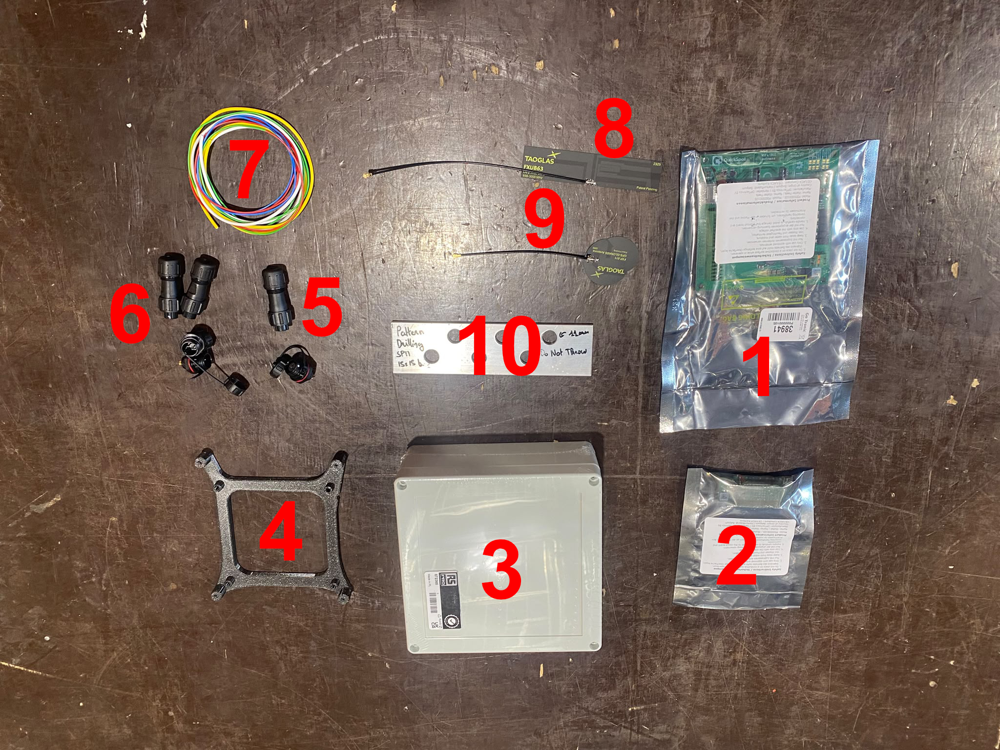
<figcaption>
Componnent List
</figcaption>
</figure>

You'll also need a soldering iron, heat shrink tubing (+ a lighter or hot
air gun to shrink it), wire strippers, and a screwdriver.

This page builds the **generic datalogger** - Walter, Walter Feels, box,
antennas, battery/solar charging power, and SDI-12. It does not cover the
ADS1115 analog-input add-on (the two 4-pin "AN1"/"AN2" connectors reading
an instrumented source like a solar panel's or wind turbine's voltage/
current) - if you're building an **Open Renewable Lab** station
specifically, come back to
[Getting started](getting-started.md) and [Hardware](hardware.md) once
this base build is done.

## Building it

### 1. Drill the enclosure

<figure markdown>
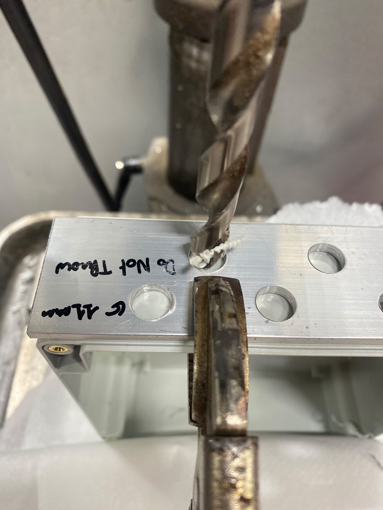
<figcaption>
Drilling the box (item 3) for the SP11 connectors, using a reusable
drilling jig/template (labeled "Pattern Drilling SP11 - Do Not Throw") to
keep every hole's position and spacing consistent across builds.
</figcaption>
</figure>

### 2. Solder the power plugs (battery + solar charging)

<figure markdown>
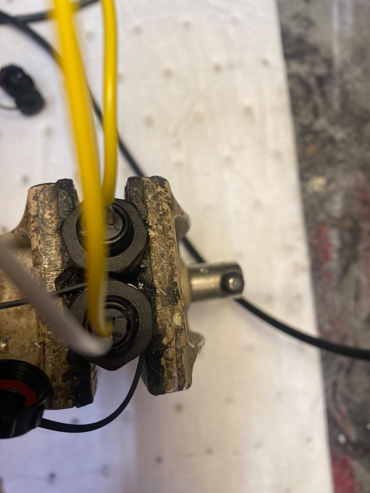
<figcaption>
Soldering wires onto the two SP11 2-pin connectors (item 6) - one for the
battery, one for the solar panel that charges it. Get the polarity right
and consistent between both connectors before shrinking anything down over
the joints.
</figcaption>
</figure>

<figure markdown>
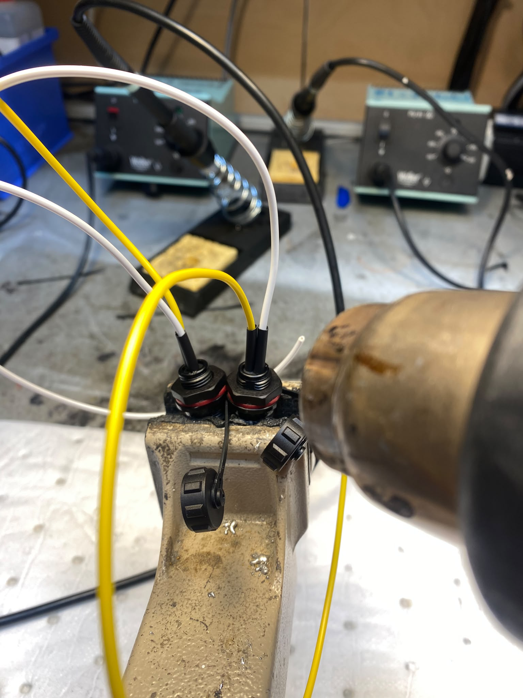
<figcaption>
Heat-shrink over each solder joint once you're happy with it - both for
strain relief and to keep the two adjacent pins from ever shorting.
</figcaption>
</figure>

### 3. Solder the SDI-12 plug(s)

<figure markdown>
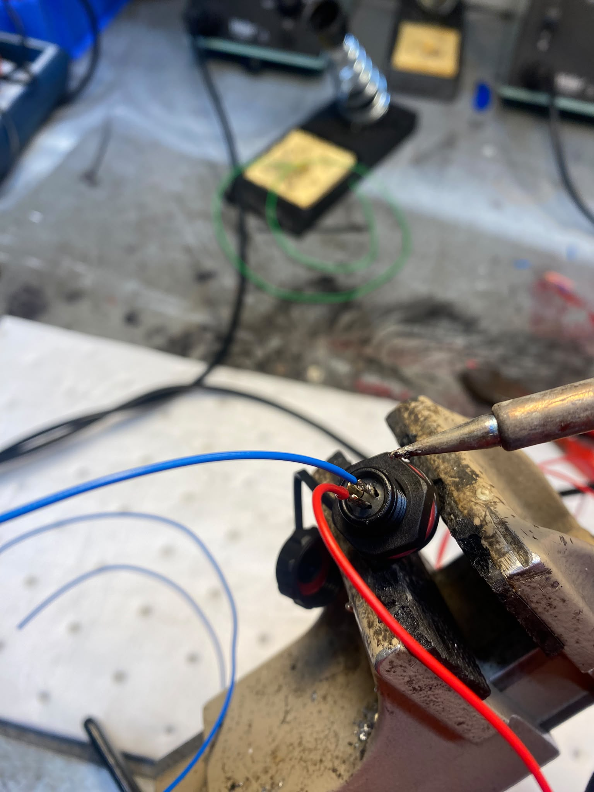
<figcaption>
Same idea for the SP11 3-pin connector(s) (item 5) - one per SDI-12 port
you want on the box (three wires: signal, power, ground).
</figcaption>
</figure>

<figure markdown>
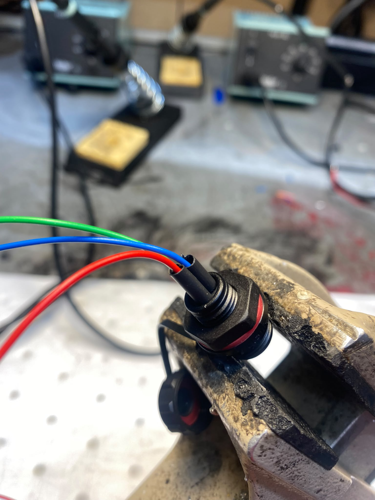
<figcaption>
Heat-shrink these joints too before moving on.
</figcaption>
</figure>

### 4. Mount all the plugs in the enclosure

<figure markdown>
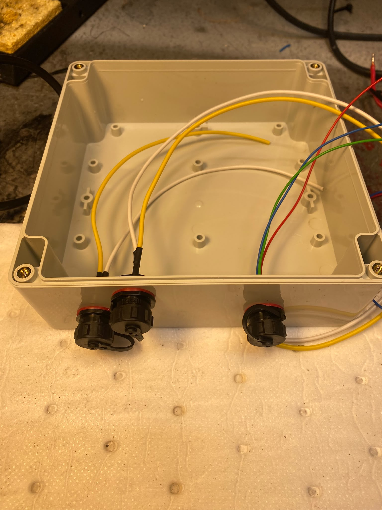
<figcaption>
Feed each finished connector through its drilled hole and tighten it down
- gland-nut side out, wires trailing inside the box, ready to reach the
board once it's mounted.
</figcaption>
</figure>

### 5. Mount the board and connect the antennas

Screw the 3D-printed support (item 4) into the enclosure, then mount the
Walter + Walter Feels board onto it. Connect the LTE antenna (item 8,
TAOGLAS FXUB63) and the GNSS antenna (item 9, TAOGLAS FXP-611) to their
u.FL connectors on the board, and route both antenna cables to wherever
you're mounting the antennas themselves on/outside the enclosure.

### 6. Wire the plugs to the board

<figure markdown>

<figcaption>
Connect each plug's wires to the matching screw terminal on the Walter
Feels board - battery to the <code>BATTERY</code> terminal, SDI-12 signal/
power/ground to the labeled <code>SDI12</code>/<code>GND</code>/<code>12V</code>
terminals. This example board also has the optional analog add-on wired
in (not part of this base build) - yours will just have the battery,
solar charging, and SDI-12 connections at this stage.
</figcaption>
</figure>

### 7. Label the enclosure

<figure markdown>
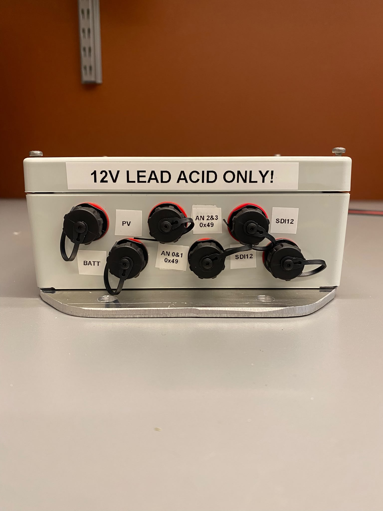
<figcaption>
Label every external connector so nobody has to guess later, and mark the
battery chemistry the box is built for - Walter Feels' onboard LTC4015
charger is configured for one chemistry at a time (see
[USER_MANUAL.md §6.5](USER_MANUAL.md#65-onboard-walter-feels-sensors-battery-temperature-humidity-pressure)),
so a clear warning label prevents someone plugging in the wrong battery
type. This example also shows the optional AN1/AN2 analog inputs - skip
those two labels if you're not adding that piece.
</figcaption>
</figure>

### 8. Seal the cable lead-through

<figure markdown>
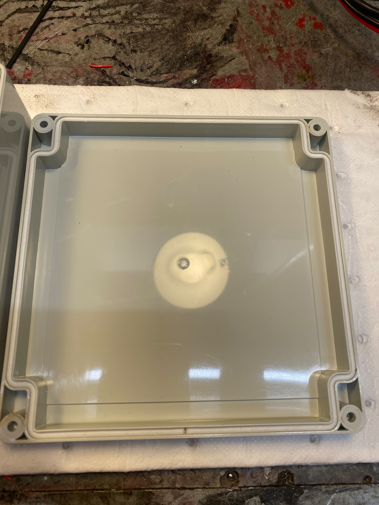
<figcaption>
A rubber grommet/gasket around the cable lead-through - this is what keeps
that entry point water-tight, not a cosmetic touch, so don't skip it even
on an indoor build.
</figcaption>
</figure>

### 9. Insert the microSD card

<figure markdown>
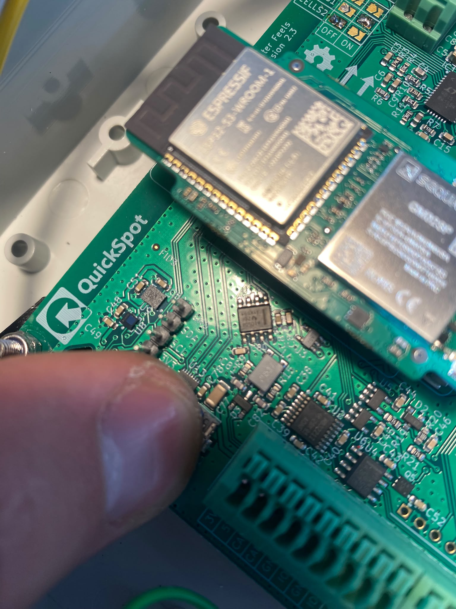
<figcaption>
Insert a FAT32-formatted microSD card into the slot on the board - this is
where sensor data gets logged locally regardless of whether MQTT is set
up (see [USER_MANUAL.md §10.1](USER_MANUAL.md#101-on-the-sd-card)).
</figcaption>
</figure>

### 10. Insert the SIM card (cellular only)

<figure markdown>
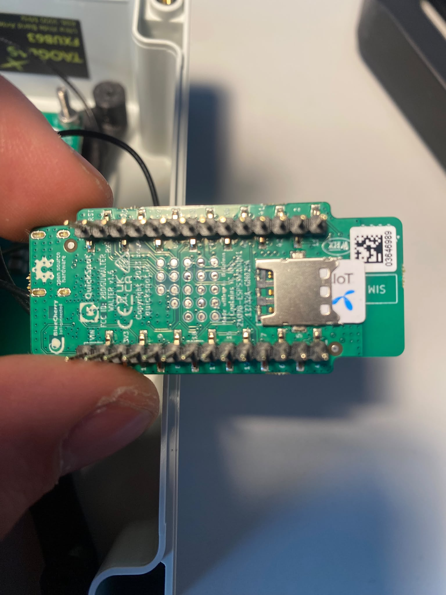
<figcaption>
Only needed if you're using cellular data instead of WiFi - insert your
IoT/M2M SIM into the Walter module's SIM slot before closing up the box.
</figcaption>
</figure>

## Next steps

Close up the enclosure and you have a working generic datalogger. From
here:

- [Firmware downloads](firmware-downloads.md) - get firmware onto the
  board if it isn't already flashed.
- [User Manual](USER_MANUAL.md) - first boot, connecting to the setup
  hotspot, and configuring SDI-12 sensors, MQTT, and networking.
- Building an **Open Renewable Lab** station specifically (the ADS1115
  analog add-on for instrumenting a solar panel and/or wind turbine)?
  Continue with [Getting started](getting-started.md).