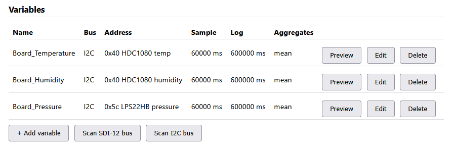
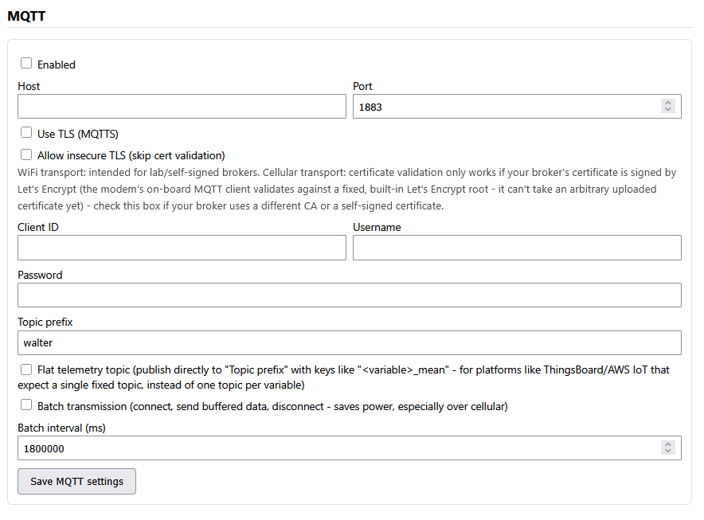

# Getting started: solar panel & wind turbine on the Open Renewable Lab

This walkthrough takes you from an unwired RS PRO 20 W solar panel to live
`PV_Voltage` and `PV_Current` readings in ThingsBoard. The Open Renewable
Lab's 100 W vertical-axis wind turbine works exactly the same way — both
sources ship **pre-instrumented** with a load, a resistive voltage divider,
and a current shunt already wired to a 4-pin plug, so there's no sensor
wiring for you to build. The two share the *exact same voltage-divider
design*, so almost every step below applies to both unchanged; the one
real difference is the current shunt (the PV panel uses a 1 Ω shunt, the
turbine a 10 A/75 mV shunt), which changes one calibration number — called
out explicitly in [step 4](#4-preview-and-calibrate) rather than repeated
as a second full walkthrough. This guide uses the solar panel as its
running example; wherever the turbine differs, it says so.

It assumes you're starting from a fresh Open Renewable Lab enclosure (see
[Hardware](hardware.md) for what's inside it) with firmware already
flashed — if not, do [Firmware downloads](firmware-downloads.md) first.

No programming is required for any of this — everything below is either
physical wiring or the device's own web portal, described in full in the
[User Manual](USER_MANUAL.md). This page only covers the parts specific to
an instrumented PV panel or wind turbine; it links to the User Manual for
general portal reference rather than repeating it.

## What you'll need

- An RS PRO 20 W solar panel (or similar small panel), a 100 W
  vertical-axis wind turbine, or both — the steps are the same regardless
  of exact wattage, and an enclosure with both connected just uses one
  analog input per source (see [step 1](#1-how-the-analog-input-works)).
- An Open Renewable Lab enclosure, powered on **with a battery connected
  to BATT**. This isn't optional: the AN1/AN2 analog inputs (and every
  other external I2C device) are powered from a rail derived from the
  battery/PV input, not from USB — running on USB alone, no battery, the
  ADS1115 simply won't be powered and Preview will fail with no obvious
  reason why.
- A multimeter (for the voltage calibration step).
- A phone or laptop with WiFi, to reach the device's setup portal.
- A [ThingsBoard](https://thingsboard.io/) account — either your
  instructor's own instance, or the public
  [demo.thingsboard.io](https://demo.thingsboard.io/) sandbox for testing.

## ⚠ Safety note

Unlike a bench power supply, a solar panel has **no off switch** — any
panel in daylight (even indoor room light will produce a small voltage) is
live the moment it's wired up. Keep the panel covered with an opaque cloth
or bag while making connections, and only uncover it once wiring is
complete and double-checked.

A wind turbine has the same "always live" electrical hazard whenever its
blades are moving (even a light breeze is enough to produce a small
voltage), **plus** a mechanical one — don't work on its wiring while the
blades can spin. Lock/tie the rotor before connecting or disconnecting its
plug, the same way you'd cover the solar panel.

## 1. How the analog input works

⚠ **Not the PV gland.** The enclosure also has a connector labeled **PV**
— that one charges the *logger's own* operating battery from a small
auxiliary panel (straight into the onboard LTC4015 charger), and is
unrelated to measuring your panel or turbine. Your instrumented source
plugs into **AN1** or **AN2** instead (see
[Hardware](hardware.md#connector-reference)) — pick whichever is free; this
guide uses AN1. If you have both a solar panel and a wind turbine wired
into the same enclosure, they just take one analog input each (AN1 for
one, AN2 for the other) — there's no fixed pairing, either input works for
either source.

Each of AN1/AN2 is a generic 4-pin analog input exposing two of the
external ADS1115 ADC's four single-ended channels at I2C address **73**
(`0x49`) — AN1 is `AIN0`/`AIN1`, AN2 is `AIN2`/`AIN3`. The instrumented
source's own 4-pin plug carries both the voltage-divider output and the
current-shunt output, one per channel — the same layout for the solar
panel and the wind turbine, only the shunt's rating (and so the current
calibration in [step 4](#4-preview-and-calibrate)) differs between them:

| Signal | AN1 channel | Circuit | What it measures |
|---|---|---|---|
| PV voltage | `AIN0` | Resistive divider, designed to scale a panel voltage up to roughly the divider's rated ~22 V down to the sensor's ~5 V input range | The panel's terminal voltage |
| PV current | `AIN1` | A 1 Ω 0.5% shunt resistor in the panel's current path | The panel's output current — by design, **1 V measured = 1 A** |
| WT voltage | `AIN0` | The same resistive divider design as the PV panel's, sized for the turbine's own rated output | The turbine's terminal voltage |
| WT current | `AIN1` | A 10 A/75 mV shunt resistor in the turbine's current path (**not** the PV panel's 1 Ω) | The turbine's output current — see [step 4](#4-preview-and-calibrate) for the calibration this shunt needs |

(Using AN2 instead just means `AIN2` for voltage and `AIN3` for current
below — everything else is identical. This also applies per-source: e.g.
solar panel on AN1 and wind turbine on AN2 in the same enclosure means
`AIN0`/`AIN1` for `PV_Voltage`/`PV_Current` and `AIN2`/`AIN3` for
`WT_Voltage`/`WT_Current`.)

## 2. Connect the panel or turbine

1. With the panel covered (or the turbine's rotor locked), plug its
   instrumented 4-pin connector into the enclosure's **AN1** gland (or
   **AN2** — just be consistent with which channels you configure in
   [step 3](#3-add-the-two-variables-in-the-portal)).
2. Double-check the plug is fully seated before uncovering the panel/
   releasing the rotor — a reversed/miswired current path won't damage the
   sensing circuit at this scale, but will show up as a negative reading
   (see [step 4](#4-preview-and-calibrate)).
3. Uncover the panel (or release the rotor) once you're done.

## 3. Add the two variables in the portal

Connect to the device's `WalterSensor-XXXX` hotspot and log in (see
[USER_MANUAL.md §3-4](USER_MANUAL.md#3-quick-start) if this is your first
time). Under **Variables**, add two new I2C variables using the field
reference in [USER_MANUAL.md §6.1](USER_MANUAL.md#61-adding-a-variable):

**PV_Voltage**

| Field | Value |
|---|---|
| Name | `PV_Voltage` |
| Bus type | `I2C` |
| I2C address | `73` |
| Device type | `ADS111x` |
| ADS111x input | `AIN0` |
| Gain / full-scale range | `±6.144V` to start (the divider's designed output tops out around 5 V) |

**PV_Current**

| Field | Value |
|---|---|
| Name | `PV_Current` |
| Bus type | `I2C` |
| I2C address | `73` |
| Device type | `ADS111x` |
| ADS111x input | `AIN1` |
| Gain / full-scale range | `±2.048V` to start (a 20 W-class panel's short-circuit current stays well under 2 A, so under 2 V across a 1 Ω shunt) |

**Using the wind turbine instead (or as well)?** Add `WT_Voltage`/
`WT_Current` the same way — same Bus type/I2C address/Device type, `AIN0`/
`AIN1` (or `AIN2`/`AIN3` on AN2) as above, `±6.144V` for `WT_Voltage`. The
one field that's genuinely different is `WT_Current`'s **Gain /
full-scale range**: its 10 A/75 mV shunt only ever produces up to 75 mV
even at full rated current, so use `±0.256V` (the highest-resolution
range) rather than PV_Current's `±2.048V` — see
[step 4](#4-preview-and-calibrate) for why the shunt difference also
means a different calibration number, not just a different gain.

If the address `73` doesn't respond, use the portal's **Scan I2C bus**
button ([USER_MANUAL.md §6.2](USER_MANUAL.md#62-finding-your-sensors-address))
to confirm what's actually on the bus before assuming a wiring problem.

<figure markdown>

<figcaption>
The Variables list after adding variables — each row shows its bus,
address, sample/log intervals, and aggregates, with Preview/Edit/Delete
per row (this example shows the three onboard environment variables that
ship enabled by default, not PV_Voltage/PV_Current — yours will look the
same shape once you've added those two).
</figcaption>
</figure>

## 4. Preview and calibrate

Leave both variables' calibration at the default (`a=1`, `b=0`) for now,
then click **Preview** on each (see
[USER_MANUAL.md §6.4](USER_MANUAL.md#64-testing-a-sensor-preview)) with the
panel uncovered (or the turbine spinning) in reasonable conditions. The
steps below are written for `PV_Voltage`/`PV_Current` — if you added
`WT_Voltage`/`WT_Current` instead, the *voltage* calibration is identical
(same divider), but the *current* calibration is not (different shunt) —
see the callout at the end of each subsection.

### PV_Current: usually needs no calibration

Because the sensing resistor is a 1 Ω shunt, the raw ADC reading in volts
already **is** the current in amps — `a=1, b=0` is correct as-is, this
isn't a placeholder. If Preview shows a **negative** value, the shunt is
seeing current flow in the direction opposite of what the firmware assumes;
either physically swap the panel's leads, or set `a=-1` in the portal to
flip the sign in software (see
[USER_MANUAL.md §6.6](USER_MANUAL.md#66-calibrating-a-variable-ax-b)).

> **`WT_Current` is different: it needs `a ≈ 133.3`, not `a=1`.** The wind
> turbine's shunt is rated 10 A at 75 mV, not 1 Ω, so 1 V measured is
> *not* 1 A — the raw ADC voltage has to be scaled up to turn a shunt
> reading into amps: `a = rated_current / rated_shunt_voltage = 10 / 0.075
> ≈ 133.3` (leave `b = 0`). Concretely, at the shunt's full rated 10 A the
> raw Preview reads `0.075 V`, and `0.075 × 133.3 ≈ 10 A` — that's the
> multiplier doing its job. As with `PV_Current`, a negative reading means
> swapped leads (fix physically, or set `a=-133.3`), not a wiring fault.
> This isn't something to measure/derive yourself — it comes directly
> from the shunt's own rating, unlike the voltage divider below.

### PV_Voltage: calibrate against a multimeter

The divider's exact ratio depends on the resistors actually populated on
your board, so rather than trust a fixed number, measure it directly:

1. With the panel connected and in light, measure its voltage directly
   with a multimeter across the PV+/PV− leads. Call this `V_multimeter`.
2. Read the **raw, uncalibrated** value from the portal's Preview
   (`a=1, b=0` still set). Call this `V_raw`.
3. Set the calibration multiplier: `a = V_multimeter / V_raw` (leave
   `b = 0`).

**Worked example**: a multimeter reads `21.7 V` across the panel; the
portal's raw Preview shows `4.93 V`. Then
`a = 21.7 / 4.93 ≈ 4.40`, entered as the PV_Voltage calibration multiplier.
(This lines up with the divider's design target of scaling up to ~22 V down
to a ~5 V sensor range — expect `a` to land somewhere around 4-5 on this
board, but always calibrate against your own multimeter reading rather than
assuming that exact number.)

> **`WT_Voltage` uses this exact same procedure** — measure across the
> turbine's own output leads instead of the panel's, with the turbine
> spinning steadily, and calculate `a` the same way. It's the same divider
> design, just sized for the turbine's own rated voltage, so don't assume
> the same `a` value you got for `PV_Voltage` — calibrate it independently.

Re-run Preview after saving the calibration and confirm it now matches your
multimeter reading.

## 5. Set up MQTT → ThingsBoard

1. In ThingsBoard, create a device (**Devices → +  → Add new device**),
   give it a name (e.g. `PV-Panel-01` or `Wind-Turbine-01`), and save. If
   your enclosure has both a solar panel and a wind turbine wired in, they
   share one device — all four variables (`PV_Voltage`, `PV_Current`,
   `WT_Voltage`, `WT_Current`) come from the same logger and publish to the
   same topic, so one device/one access token covers both.
2. Open the device and copy its **access token** (device details →
   **Device credentials** → **Copy access token**, or in older ThingsBoard
   UIs, right-click the device → **Copy access token**).
3. Back in the Open Renewable Lab portal, under **MQTT**
   ([USER_MANUAL.md §7.1](USER_MANUAL.md#71-basic-settings)):

   | Field | Value |
   |---|---|
   | Enabled | ✓ |
   | Host | Your ThingsBoard instance's hostname (e.g. `demo.thingsboard.io`) |
   | Port | `8883` with **Use TLS** for UNIS Thingsboard |
   | Username | The device access token you copied |
   | Password | Leave blank |
   | Topic prefix | `v1/devices/me/telemetry` |
   | Flat telemetry topic | ✓ |

   <figure markdown>
   
   <figcaption>
   The portal's MQTT settings form — the fields above map directly onto
   this.
   </figcaption>
   </figure>

   Save, then watch **MQTT connected** on the Status panel — see
   [USER_MANUAL.md §7.2](USER_MANUAL.md#72-testing-your-connection) if it
   doesn't come up.
4. While testing, you can temporarily shorten your variables' **Log/
   aggregate interval** (e.g. to `30000` ms) so you don't have to wait for
   the default 5-minute interval to see your first MQTT publish — see
   [USER_MANUAL.md §6.3](USER_MANUAL.md#63-understanding-sampling-vs-logging-vs-aggregation).
   Set it back to a sensible value once you've confirmed everything works.

## 6. Confirm data in ThingsBoard

Open the device in ThingsBoard and check its **Latest telemetry** tab. Once
a log interval has elapsed, you should see keys like `PV_Voltage_mean` and
`PV_Current_mean` (or `WT_Voltage_mean`/`WT_Current_mean` for the turbine —
one `<variable>_<aggregate>` key per aggregate you enabled on each
variable — see
[USER_MANUAL.md §7.3](USER_MANUAL.md#73-understanding-topics-and-payloads)
for the full payload shape). From here, you can build a ThingsBoard
dashboard with widgets charting these values in real time — see
ThingsBoard's own documentation for adding widgets to a dashboard.

Your data is also being logged to the SD card the whole time, independent
of MQTT — see [USER_MANUAL.md §10.1](USER_MANUAL.md#101-on-the-sd-card) if
you want a local backup or to analyze it in pandas/Excel later.

## Troubleshooting

See [USER_MANUAL.md §15](USER_MANUAL.md#15-troubleshooting) for general
issues (sensor not responding, MQTT never connecting, etc.). PV/wind
turbine-specific notes:

- **Preview fails / Scan I2C bus finds nothing at all**, on *every*
  address, not just `73`: check there's a **battery connected to BATT**.
  The external I2C bus (everything on AN1/AN2, and BATT's own LTC4015)
  is powered from a battery/PV-derived rail — running the board on USB
  alone with no battery, that whole bus is simply unpowered, which looks
  identical to "nothing responds." This is expected in that situation,
  not a fault.
- **PV_Voltage/WT_Voltage Preview reads ~0** with the panel in good light
  (or the turbine spinning) and a battery connected: check the plug is
  actually in **AN1** (not the **PV** gland, which won't measure anything
  — see [step 1](#1-how-the-analog-input-works)) and that the ADS111x
  input selected in the variable matches the connector you used
  (`AIN0`/`AIN1` for AN1, `AIN2`/`AIN3` for AN2), and that the I2C address
  is `73`.
- **`WT_Current` reads a value roughly 100× too small**: this is almost
  always a leftover `a=1` calibration copied from the PV setup — the wind
  turbine's shunt needs `a ≈ 133.3`, not `a=1` (see
  [step 4](#4-preview-and-calibrate)); `PV_Current`'s "no calibration
  needed" shortcut doesn't carry over.
- **Readings look reasonable but don't match your multimeter**: re-check
  the calibration multiplier from [step 4](#4-preview-and-calibrate) — a
  stale `a` from before you calibrated is the most common cause.
